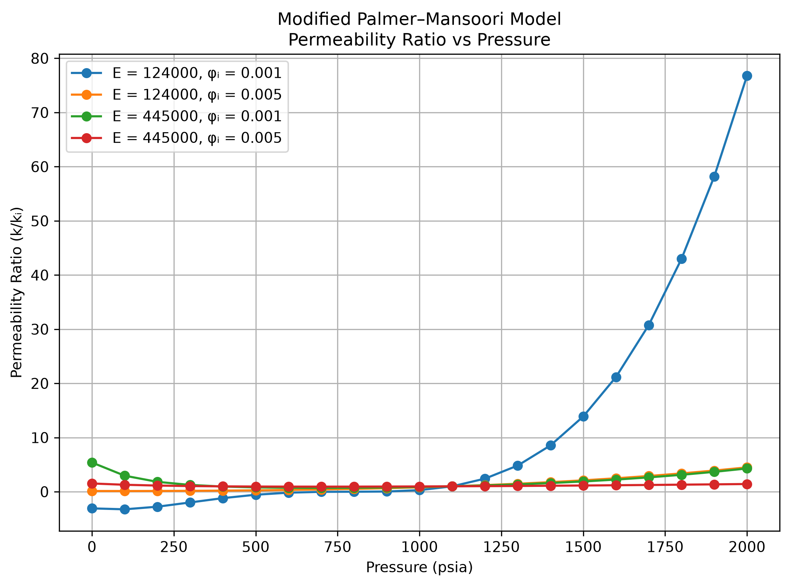
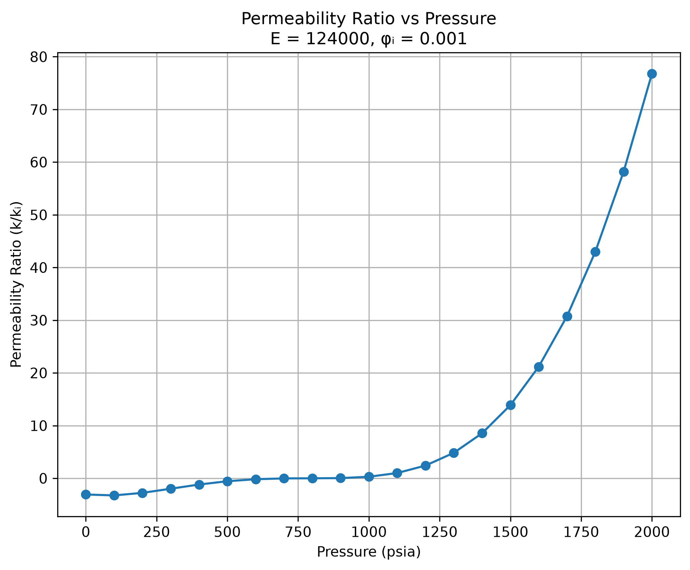
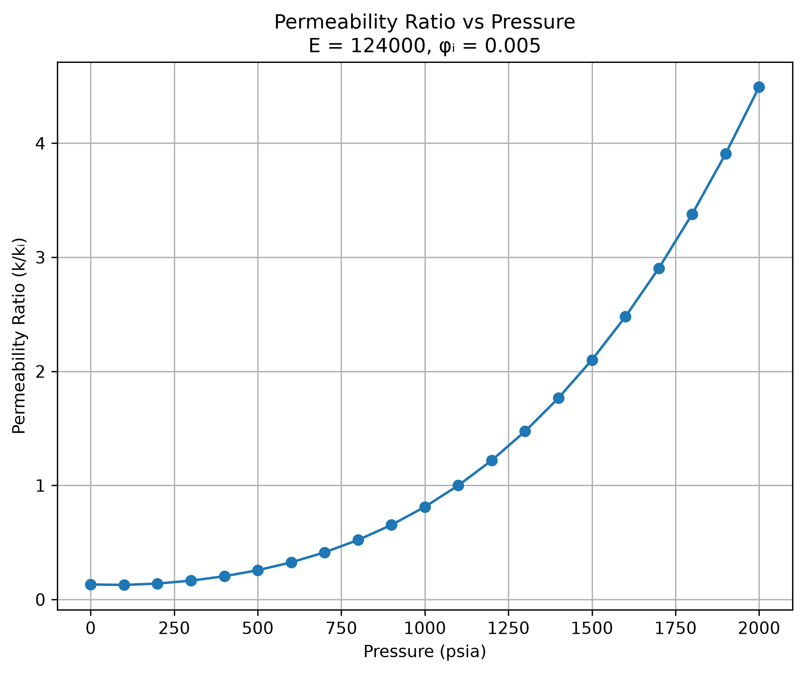
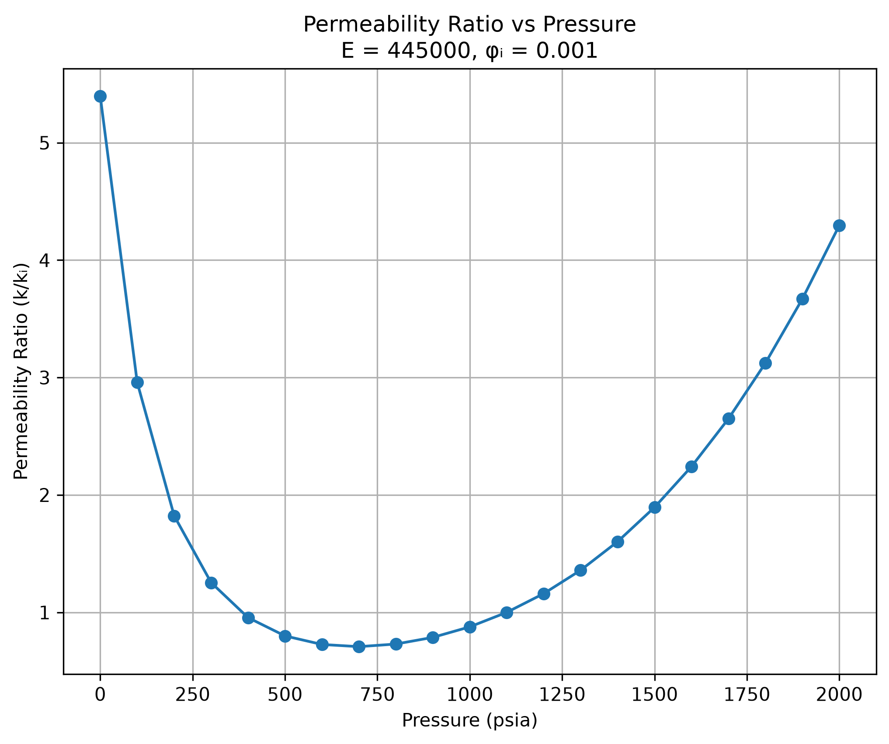
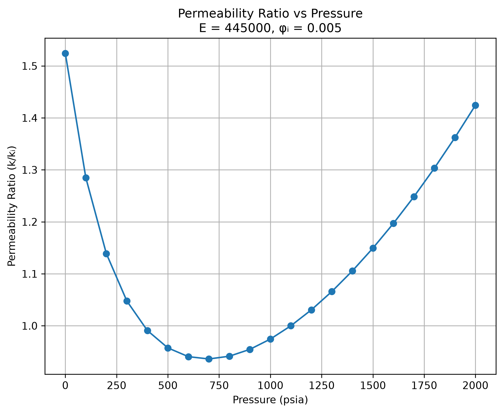

# Modified Palmer–Mansoori Permeability Model

<p align="center">
  
  
  
  
  
</p>

<p align="center">
  <strong>A Python-based portfolio adaptation of an academic engineering project analyzing permeability variation in coalbed methane reservoirs under pressure depletion.</strong>
  <br>
  The project recreates the Modified Palmer–Mansoori model calculations using Python and examines four scenarios with different initial porosity and Young’s modulus values.
</p>

---

## 📑 Table of Contents

- [About This Project](#about-this-project)
- [Problem Statement](#problem-statement)
- [Project Objectives](#project-objectives)
- [Model Background](#model-background)
- [Input Parameters and Scenario Analysis](#input-parameters-and-scenario-analysis)
- [Project Structure](#project-structure)
- [Methodology](#methodology)
  - [1. Input Parameter Preparation](#1-input-parameter-preparation)
  - [2. Python Model Implementation](#2-python-model-implementation)
  - [3. Scenario Analysis](#3-scenario-analysis)
  - [4. Output Generation and Visualization](#4-output-generation-and-visualization)
- [Key Findings](#key-findings)
- [Validation and Verification](#validation-and-verification)
- [Technical Specifications](#technical-specifications)
- [How to Run the Project](#how-to-run-the-project)
- [Limitations](#limitations)
- [Academic Context](#academic-context)
- [Author](#author)

---

## About This Project

This project presents a Python-based adaptation of my B.Tech major project in Applied Petroleum Engineering, which investigated permeability variation in coalbed methane (CBM) reservoirs under pressure depletion.

The original academic work used Excel and MATLAB. For this portfolio version, I recreated the model calculations in Python and organized the inputs, scenario calculations, and generated outputs into a reproducible workflow.

The project demonstrates:

- **Engineering model implementation:** Recreating the Modified Palmer–Mansoori model equations in Python.
- **Parameter-driven calculations:** Reading model and scenario parameters from CSV files.
- **Scenario analysis:** Evaluating four combinations of initial porosity and Young’s modulus.
- **Numerical analysis:** Calculating porosity and permeability ratios over a range of reservoir pressures.
- **Data processing:** Using Pandas to organize model inputs and calculated results.
- **Visualization:** Using Matplotlib to examine model responses across different scenarios.
- **Technical interpretation:** Comparing scenario behavior while recognizing the limitations of the underlying mathematical formulation.

---

## Problem Statement

Coalbed methane permeability can change as reservoir pressure declines during production. The response depends on the interaction between coal matrix shrinkage and cleat compressibility, as well as the properties and parameters used in the model.

Understanding this response requires examining how the model behaves under different input conditions rather than considering pressure depletion in isolation.

This project implements the Modified Palmer–Mansoori formulation in Python to calculate porosity and permeability ratios across a pressure range and compare the resulting responses under four parameter combinations.

---

## Project Objectives

1. Recreate the model calculations in Python using the original academic model as the reference.
2. Organize input parameters and scenario definitions into separate CSV files.
3. Calculate porosity and permeability ratios across a specified pressure range.
4. Compare the effects of initial porosity and Young’s modulus across four scenarios.
5. Generate structured CSV outputs and plots for interpretation.
6. Compare Python calculations with the original Excel model outputs and document numerical differences and model limitations.

---

## Model Background

Coalbed methane reservoirs contain natural fractures, commonly called cleats, that provide pathways for gas flow.

Two mechanisms influence the permeability response during pressure depletion:

- **Matrix shrinkage:** Gas desorption can cause the coal matrix to shrink, potentially increasing cleat aperture.
- **Cleat compressibility:** Changes in effective stress can compress the cleats, potentially reducing their aperture and permeability.

The Modified Palmer–Mansoori formulation represents the combined effects through a porosity-ratio equation. Permeability ratio is then calculated from the porosity ratio.

### Model Equations
The permeability ratio is calculated as:

The normalized porosity ratio is calculated using the following expression:

<p align="center">
  
</p>

The permeability ratio is calculated as:

<p align="center">
  
</p>

Where:

| Symbol | Description |
|---|---|
| φ | Porosity at pressure p |
| φᵢ | Initial porosity |
| k | Permeability at pressure p |
| kᵢ | Initial permeability |
| p | Reservoir pressure |
| pᵢ | Initial reservoir pressure |
| pₗ | Langmuir pressure |
| E | Young’s modulus |
| ν | Poisson’s ratio |
| c₀ | Cleat compressibility coefficient |

---

## Input Parameters and Scenario Analysis

The model uses the following parameters from the original academic Excel model.

### Common Parameters

| Parameter | Symbol | Value |
|---|---|---:|
| Initial reservoir pressure | pᵢ | 1,100 psia |
| Langmuir pressure | pₗ  | 625 psia |
| Cleat compressibility coefficient | c₀ | 0.013 psia⁻¹ |
| Poisson’s ratio | ν | 0.390 |

### Scenario Parameters

Four scenarios were evaluated using different combinations of initial porosity and Young’s modulus.

| Scenario | Initial Porosity (φᵢ) | Young’s Modulus (E) |
|---|---:|---:|
| 1 | 0.001 | 124,000 psi |
| 2 | 0.001 | 445,000 psi |
| 3 | 0.005 | 124,000 psi |
| 4 | 0.005 | 445,000 psi |

The model evaluates pressures from **0 to 2,000 psia**, at **100-psia intervals**, producing 21 pressure points per scenario.

---

## Project Structure

```text
Modified-Palmer-Mansoori-Model/
│
├── data/
│   ├── model_parameters.csv
│   └── scenario_parameters.csv
│
├── python/
│   └── Modified_palmer_mansoori_model.py
│
├── outputs/
│   ├── [generated scenario CSV files]
│   └── [generated PNG plots]
│
├── Modified_Palmer_Mansoori_Python_Analysis.pdf
├── requirements.txt
└── README.md
```

*The structure above describes the intended repository layout. Replace the output placeholders with the actual generated filenames and ensure that all paths match the uploaded files.*

---

## Methodology

### 1. Input Parameter Preparation

The model inputs are stored separately from the Python implementation.

- `model_parameters.csv` contains the common model parameters.
- `scenario_parameters.csv` contains the scenario-specific values of initial porosity and Young’s modulus.
- The separation of inputs from calculations makes it easier to review and modify the scenarios without changing the core equations.

**Output:** Structured model and scenario input files.

### 2. Python Model Implementation

The Python script recreates the model equations and calculates the porosity and permeability ratios for each scenario.

The implementation uses:

- **NumPy** for numerical calculations.
- **Pandas** for reading input CSV files and organizing calculated results.
- **Matplotlib** for plotting the model responses.

The calculations are parameter-driven so that the same model workflow can be applied consistently across the four scenarios.

### 3. Scenario Analysis

Each scenario combines one initial porosity value with one Young’s modulus value.

The model evaluates the response across the same pressure range, allowing comparisons between scenarios while keeping the common model parameters consistent.

The analysis examines:

- Changes in porosity ratio as pressure varies.
- Changes in permeability ratio derived from the porosity ratio.
- Differences in calculated responses across the four parameter combinations.
- The occurrence of mathematically calculated values that require cautious physical interpretation.

### 4. Output Generation and Visualization

The Python workflow generates structured CSV outputs and plots for reviewing the scenario calculations.

The CSV outputs preserve the calculated pressure values, scenario parameters, porosity ratios, and permeability ratios. The plots help compare the response across pressure levels and scenarios.

### Model Outputs

Once the output filenames are confirmed, list them here.

| Output | Purpose |
|---|---|
| Scenario CSV files | Store calculated porosity and permeability ratios |
| PNG plots | Visualize pressure-dependent model responses |
| Analysis report | Document the model, implementation, results, and limitations |

### Model Visualizations


### Model Visualizations

The following plots illustrate the calculated permeability response across the four model scenarios.

**Combined Permeability Response**



**Scenario 1 — Initial Porosity 0.001, Young’s Modulus 124,000 psi**



**Scenario 2 — Initial Porosity 0.005, Young’s Modulus 124,000 psi**



**Scenario 3 — Initial Porosity 0.001, Young’s Modulus 445,000 psi**



**Scenario 4 — Initial Porosity 0.005, Young’s Modulus 445,000 psi**



---

## Key Findings

### 1. Influence of Young’s Modulus

The model produces different permeability responses for the two Young’s modulus values under otherwise comparable input conditions.

- The calculated response depends on the combination of pressure and the selected model parameters.
- Comparisons between the two modulus values help illustrate how the elastic parameter affects the model response.

**Interpretation:** Young’s modulus is an important scenario variable, but its effect should be interpreted together with initial porosity and the other model parameters.

### 2. Influence of Initial Porosity

The scenarios use initial porosity values of 0.001 and 0.005.

- Changing initial porosity changes the calculated porosity ratio response.
- Because permeability ratio is calculated as the cube of the porosity ratio, changes in the porosity ratio can produce larger differences in the calculated permeability ratio.

**Interpretation:** The relationship between porosity ratio and permeability ratio makes it important to examine both calculated outputs when comparing scenarios.

### 3. Pressure-Dependent Permeability Response

The model calculates porosity and permeability ratios over the pressure range of 0–2,000 psia.

- The calculated response varies with pressure and the chosen scenario parameters.
- Different parameter combinations can produce different response patterns, including declines and increases in the calculated permeability ratio.
- The direction and magnitude of the response should be evaluated within the assumptions and mathematical limits of the model.

**Interpretation:** Scenario comparisons help reveal model sensitivity to input conditions, but the calculated trends should not automatically be treated as field-observed behavior.

### 4. Nonphysical Values at Extreme Depletion

Some scenarios produce negative porosity ratios and, consequently, negative permeability ratios at low pressures.

- These values arise from the model's unconstrained mathematical formulation.
- Negative permeability ratios are not physically meaningful as actual reservoir permeability values.

**Interpretation:** Such results identify a limitation of the formulation and should be reported transparently rather than clipped or presented as physically valid predictions.

---

## Validation and Verification

The Python calculations were compared with the original Excel model outputs across the four scenarios.

The comparison was used to check whether the Python implementation reproduced the original model's calculations over the selected pressure range.

Small numerical differences can occur because the Python implementation uses the exact value of \(2/3\), while the original Excel model uses the rounded value 0.6667 in the corresponding expression.

The comparison supports consistency between the Python recreation and the reference Excel calculations, subject to this numerical difference.

**Scope of verification:** This is a comparison against the original Excel model outputs. It does not establish independent field validation or prove that the model accurately predicts measured reservoir permeability.

---

## Technical Specifications

| Component | Technology / Approach |
|---|---|
| Programming language | Python |
| Numerical calculations | NumPy |
| Input and output processing | Pandas |
| Visualization | Matplotlib |
| Input format | CSV |
| Output formats | CSV and PNG |
| Model approach | Modified Palmer–Mansoori formulation |
| Scenario design | Four combinations of initial porosity and Young’s modulus |
| Pressure interval | 100 psia |
| Pressure range | 0–2,000 psia |
| Reference for comparison | Original academic Excel model |
| Analysis type | Numerical model recreation and scenario analysis |

---

## How to Run the Project

### 1. Clone or Download the Repository

Clone the repository using Git, or use GitHub's **Code → Download ZIP** option to download the project files.

### 2. Install Python

Install a compatible Python version if Python is not already available on your computer.

### 3. Install Dependencies

Open a terminal in the project folder and run:

```bash
pip install -r requirements.txt
```

The requirements file should list the libraries used by the script, such as:

```text
numpy
pandas
matplotlib
```

### 4. Review the Input Files

Open the CSV files in `data/` to review the common model parameters and scenario-specific inputs.

### 5. Run the Python Script

From the project root directory, run:

```bash
python python/Modified_palmer_mansoori_model.py
```

The script's input and output paths must be configured to match the repository structure. If the script uses relative paths, run it from the project root directory unless the code specifies otherwise.

### 6. Review the Results

Inspect the generated CSV files and PNG plots in the output location configured by the script. The analysis report provides additional context about the formulation, scenario behavior, verification, and limitations.

---

## Limitations

- **Model assumptions:** The calculations follow the selected Modified Palmer–Mansoori formulation and its specified input parameters.
- **Nonphysical ratios:** The formulation can produce negative porosity and permeability ratios at extreme depletion conditions. These values are mathematical outputs, not physically meaningful negative permeability predictions.
- **No physical clipping:** The Python recreation does not silently clip negative values, preserving the behavior of the implemented mathematical formulation.
- **Numerical differences:** The use of the exact \(2/3\) factor in Python instead of the rounded Excel value 0.6667 can cause small differences in calculated results.
- **No independent field validation:** The comparison is against the original Excel model outputs; field measurements and independent reservoir validation are outside the scope of this project.
- **Portfolio scope:** This repository demonstrates a Python recreation and scenario analysis of an academic engineering model. It does not claim that the original academic research was developed in Python.

---

## Academic Context

This repository is a portfolio adaptation of my B.Tech major project in Applied Petroleum Engineering, specializing in Gas Stream.

The original academic model was developed using Excel and MATLAB. This repository recreates the model calculations in Python to demonstrate numerical implementation, parameterized scenario analysis, structured data handling, and visualization.

The purpose is to make the model workflow reproducible and easier to inspect as a portfolio project, while retaining the context and limitations of the original academic formulation.

---

## Author

## Author

**Agamya Jain**

- GitHub: [@AgamyJain](https://github.com/AgamyJain)
- LinkedIn: [in/agamya-jain](https://www.linkedin.com/in/agamya-jain)

---

<p align="center">
  <strong>Modified Palmer–Mansoori Permeability Model</strong>
  <br>
  Python • NumPy • Pandas • Matplotlib • Engineering Model Analysis
</p>

[← Back to repository root](https://github.com/AgamyJain/Modified-Palmer-Mansoori-Model/blob/main/README.md)
---
